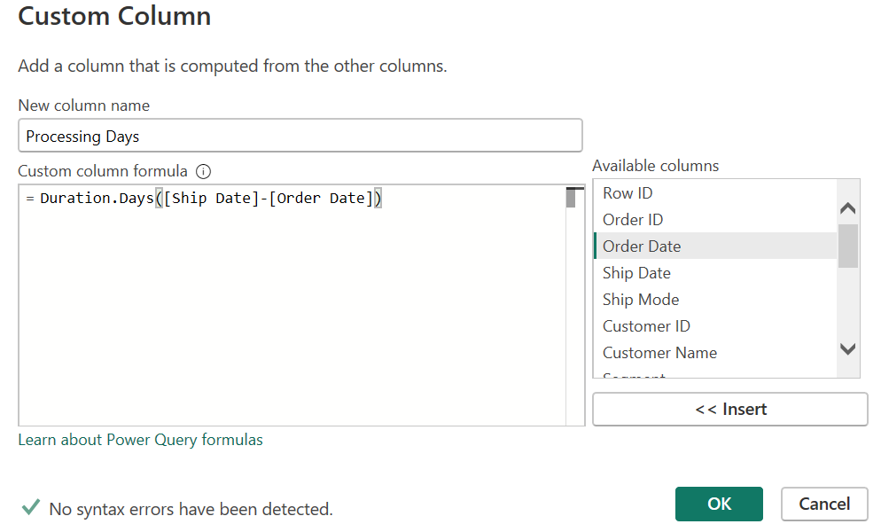
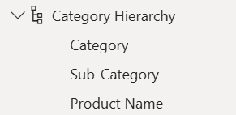
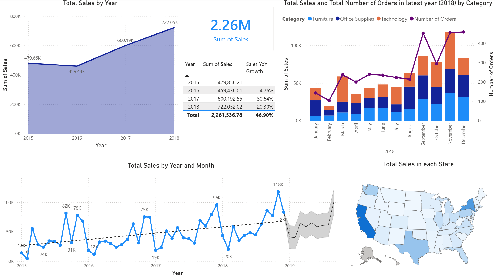
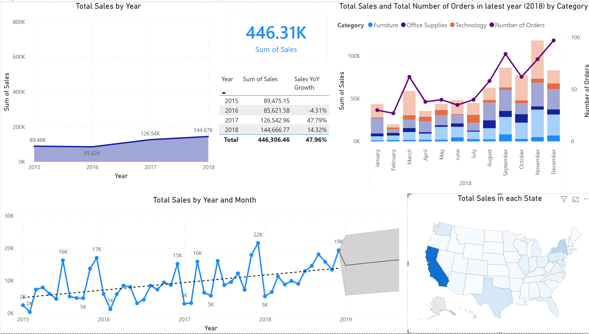
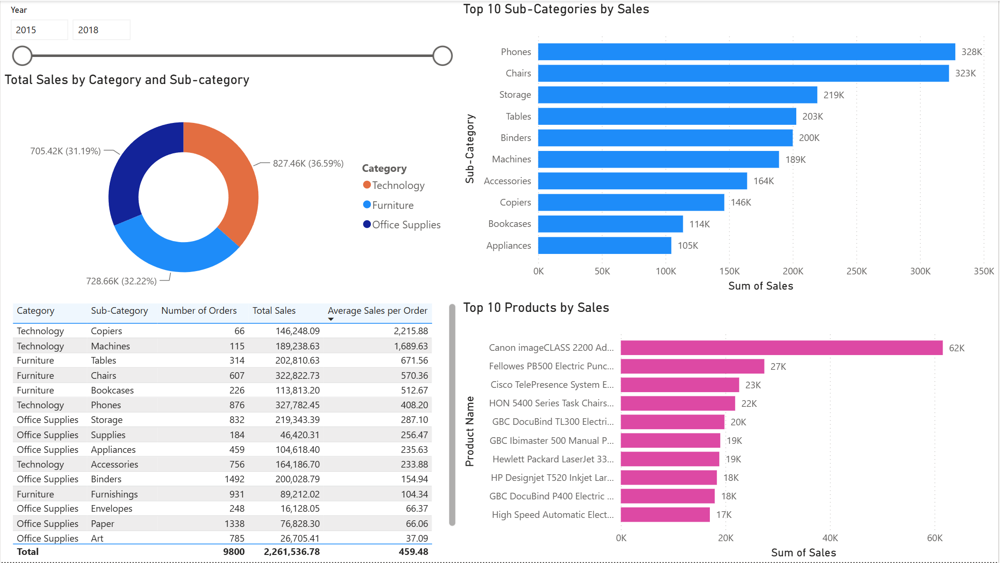
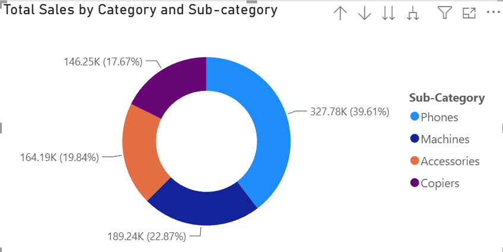
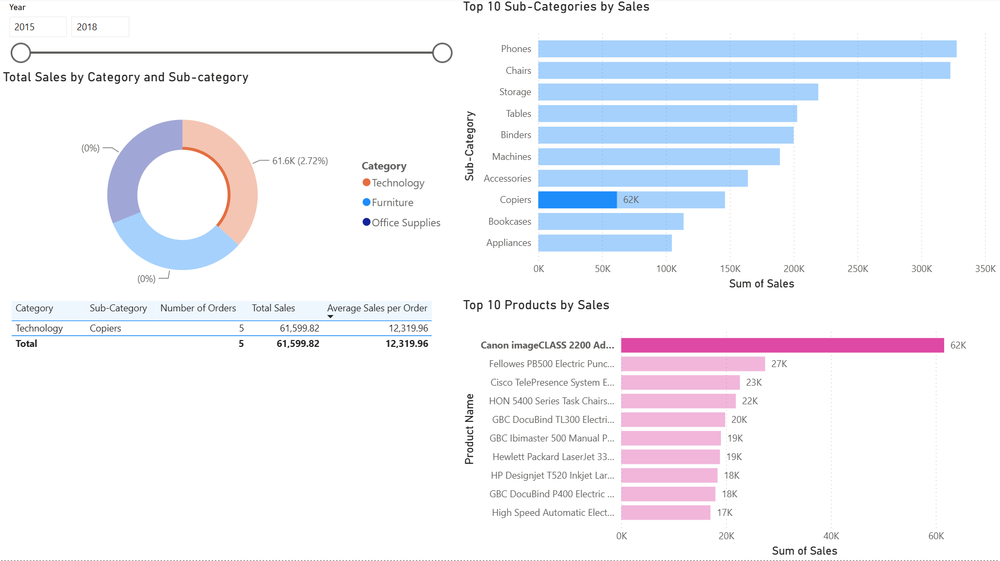
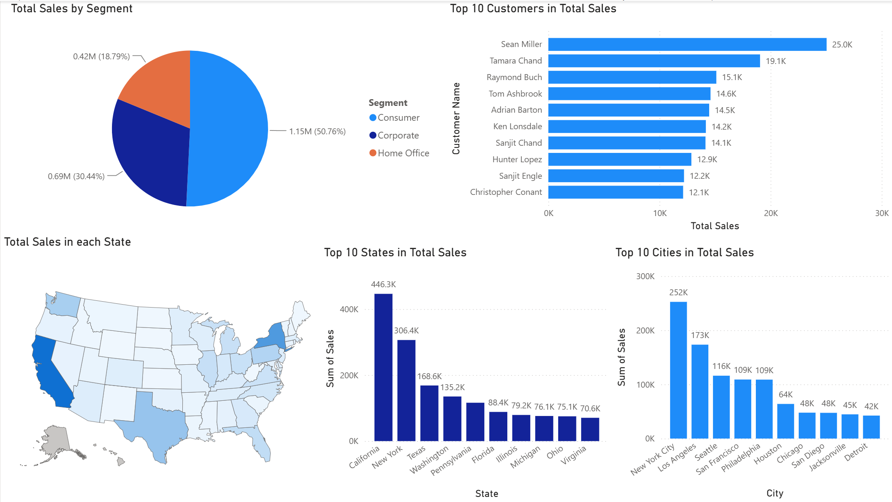
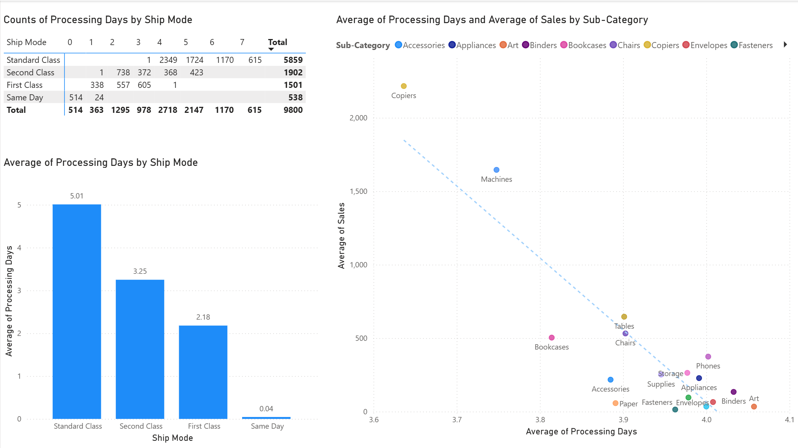

# Superstore Sales Data Visualization

A retail company sells a wide range of products to customers across different regions, states, and cities in the United States. Create **data visualization** using **PowerBI** to understand sales performance and identify patterns that can support better business and sales decisions.


## Table of Contents

* [Business Scenario](#business-scenario)
* [Dataset](#dataset)
* [Project Objective](#project-objective)
* [Key Questions](#key-questions)
* [Tools & Technologies](#tools--technologies)
* [Data Preparation & Processing - Key Steps](#data-preparation--processing---key-steps)
* [Data Visualization Report & Key Insights](#data-visualization-report--key-insights)

  * [1. Report Overview](#1-report-overview)
  * [2. Sales Trend](#2-sales-trend)
  * [3. Product Performance](#3-product-performance)
  * [4. Customer Performance](#4-customer-performance)
  * [5. Operational Performance](#5-operational-performance)
* [Business Recommendation](#business-recommendation)

  * [1. Prepare for “Peak Season”](#1-prepare-for-peak-season)
  * [2. Promote Top-Selling Products](#2-promote-top-selling-products)
  * [3. Reward High-Value Customers](#3-reward-high-value-customers)
  * [4. Strengthen Distribution in High-Sales Areas](#4-strengthen-distribution-in-high-sales-areas)
  * [5. Prioritise High-Value Orders](#5-prioritise-high-value-orders)


## Business Scenario
A retail company sells a wide range of products to customers across different regions, states, and cities in the United States. Management wants to understand sales performance and identify patterns that can support better business and sales decisions.

## Dataset

The dataset contains retail transaction records covering a four-year period from **2015 to 2018**. Each record includes information about orders, customers, geographic location, products, product categories, shipping methods, and sales, allowing performance to be analyzed from multiple perspectives. </br>
*Data source: Superstore Sales Dataset  https://www.kaggle.com/datasets/rohitsahoo/sales-forecasting*

## Project Objective

The objective of this project is to transform raw sales data into an interactive dashboard that provides clear and actionable insights into business performance. The analysis focuses on identifying sales trends, high-performing products and markets, and differences across customer segments.

## Key Questions

- How do sales change over time, and are there any noticeable trends or patterns?
- Which product categories, sub-categories, and products perform best?
- Which regions, states, and cities generate the highest sales?
- How do sales differ across customer segments and shipping methods?

## Tools & Technologies

**Power BI** is used for data cleaning and transformation, data modeling, DAX calculations, and interactive dashboard development. The project also uses **Power Query** for data preparation and **DAX** for creating analytical measures and KPIs.

## Data Preparation & Processing - Key Steps

1. **Remove duplicates**. Use command in Power Query to remove duplicate rows.
2. **Modify data types.** Change data type of column “Postal Code” from Number into Text.
3. **Create columns.** In Power Query, create a column “Processing Days” to indicate days taken to process each order, which helps to analysis the performance of processing time. 
<p align="center">
  
</p>

4. **New Measures & DAX.** In Power Query, create new measures to calculate Sales Growth Year-over-Year, and Average Sales per Order.
	```DAX
	-- Sales amount for Same Period Last Year (SPLY)
	Sales SPLY = 
		CALCULATE(
			[Total Sales], 
			SAMEPERIODLASTYEAR(superstore_sales_dataset[Order Date].[Date])
		)
		
	-- Sales growth Year-over-Year (YoY Growth)
	Sales YoY Growth = 
		DIVIDE(
    		[Total Sales] - [Sales SPLY],
    		[Sales SPLY],
    		BLANK()
		)
	
	-- Average Sales per Order
	Average Sales per Order = 
		DIVIDE(
    		[Total Sales],
    		DISTINCTCOUNT([Order ID]),
    		0
		)
	```

5. **Create data hierarchy**. Group data by hierarchical relationship for later application of drill-down function in the visuals. 
<p align="center">
  
</p>

## **Data Visualization Report & Key Insights**

### 1. Report Overview

[Download PowerBI Report](./PowerBI/superstore_sales_dashboard.pbix)

The final report has 4 pages (dashboards). Each page contains several visuals focusing on one aspects of the sales data.

- Sales Trends -  Overall sales over time, yearly growth of each year.
- Product performance - Product category performance, top sales products.
- Customer performance - Top contribution customers, top sales by states and cities.
- Operational Performance - Corelation between processing days and value of orders, how ship mode affects the processing days.

### 2. Sales Trend

This page explores sales trends over the years, the latest year sales performance in each category, and year-over-year growth to identify key changes in business performance. 

<p align="center">
  
</p>

The trend line shows overall sales has been going upwards from 2015 to 2018, so the forecasting line  shows an increasing trend in the following year. YoY Growth also confirms that there is a significant growth in 2017 and 2018.

A recurring pattern can be noticed that there is a higher sales from September to December in each year. Meaning this period of time would be the peak season for the company. 

The visual in the bottom right corner can be used as a filter, to explore further how sales trends changes for each states. For example, below screenshot shows the data visuals for California only.

<p align="center">
  
</p>


### 3. Product Performance

This page shows a detail performance of sales in terms of product categories, sub-categories, and specific products. 

<p align="center">
  
</p>

From the donut chart we can see the sales composition percentage of categories. Also the drill-down function allow us to explore the composition of sub-categories under each category, then further the specific products.

<p align="center">
  
</p>

The table and the bar charts give straight forward information about the top sales sub-categories and products. 

Interestingly, the top 1 selling product, which significantly outperformed the 2nd-ranked product, is a Cannon copier, while copier is only the 8th ranking sub-category in sales. That’s because the unit price of copier is much higher than other sub-categories, even it doesn’t have many orders.

<p align="center">
  
</p>

The slicer on top gives the option to filter the visuals in specific time range. For example, getting information for the latest year.

### 4. Customer Performance

Similar to the Product Performance page, this page shows the performance of sale in terms of the buying segment, customers, and the geographic distribution across United States.

<p align="center">
  
</p>

From this page we can see buyers from California and New York contributes the most sales amount, and so as the biggest cities in these states — Los Angeles and New York City. This suggests that population is likely to be closely related to sales in a region.

The pie chart indicates that the Consumer segment takes up more than half of total sales, followed by the Corporate segment, while the Home Office segment accounts for the smallest share. 

### 5. Operational Performance

This page focus on the processing time required for orders.  

<p align="center">
  
</p>

The matrix and column chart suggest that the number of days required to process orders is strongly associated with the selected ship mode. The “Same Day” ship mode takes the least time, as its name suggests, while the “Standard Class” ship mode takes the longest, usually more than four days.
The scatter chart on the right shows a negative correlation between the average processing time and average sales value across different sub-categories. In particular, expensive items such as Copiers and Machines tend to have shorter processing times than cheaper items.

## Business Recommendation

### **1. Prepare for “Peak Season”**

As the sales trend visuals suggest, the period from September to December is the peak sales period of the year. The company could make preparations in advance to better handle the increased demand. For example, it could hire temporary workers during this period, secure additional logistics capacity, and upgrade the infrastructure of its online shopping platforms to ensure they can handle higher traffic.

### 2. Promote Top-Selling Products

After identifying the top-selling products and sub-categories, the company can develop targeted marketing strategies to further promote these popular items, such as phones and chairs. These products could be given greater visibility by being displayed upfront of the online shopping website. The company could also offer targeted discounts on selected products to attract more orders and potentially increase sales.

### 3. Reward high-value customers

Since some customers generate significantly more revenue than others, offering them targeted rewards can boost loyalty and retention. It could offer exclusive VIP benefits, such as select discounts, faster shipping options, or premium customer support. The goal is to enhance the customer experience and incentivize these top-tier shoppers to remain loyal.

### 4. Strengthen Distribution in High-Sales Areas

The analysis identifies the states and cities that generate the highest sales. The company could allocate more inventory and logistics resources to these high-performing areas to better meet local demand. Establishing additional distribution capacity in key locations could also help reduce shipping times and improve customer satisfaction.

### 5. Prioritise High-Value Orders

Since high-value products tend to have shorter processing times, the company could consider prioritising high-value orders in its fulfilment process. Allocating sufficient operational resources to these orders may help maintain fast processing times and support a positive customer experience.

